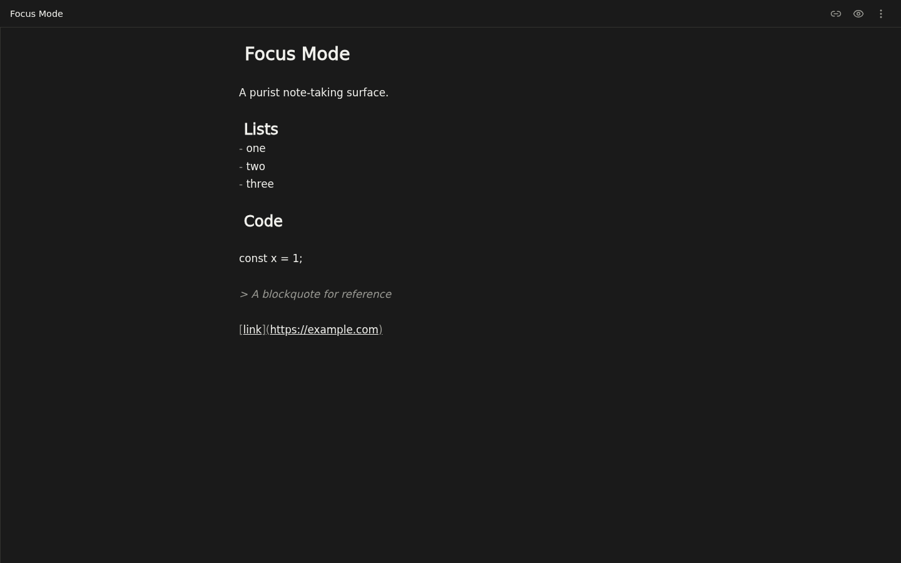
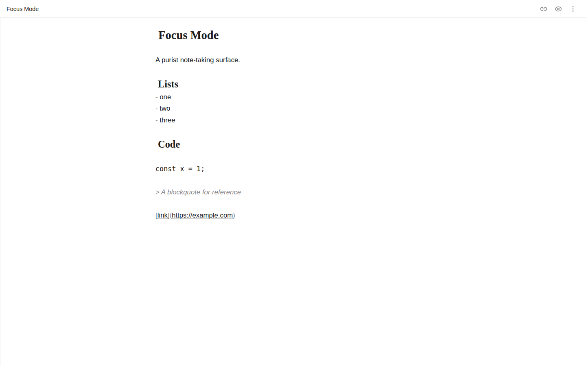

# MyNotes

Local-first, end-to-end encrypted note taking. Open the app, get a blank page, start typing. Share a link, collaborate in real time.

Try it live at **[notes.mdelacour.com](https://notes.mdelacour.com)**.

## What is MyNotes

MyNotes is a note-taking app built around a single idea borrowed from Excalidraw: **one blank page**. No folders, no dashboards, no accounts — you open the app, write, and it's saved.

- **Local-first** — every note lives in your browser's IndexedDB and works fully offline. Your data is yours before it is ever sent anywhere.
- **End-to-end encrypted** — every note is encrypted with AES-GCM before it leaves your device. The key lives only in the URL fragment of your share link; it is never sent to the server and never logged.
- **Live collaboration** — share a link and co-edit in real time. Plaintext never touches the network; only ciphertext does.
- **Zero-knowledge server** — the backend is a dumb relay. It stores and broadcasts encrypted bytes it structurally cannot read, which means there is nothing to leak, subpoena, or mine.
- **No accounts, no tracking** — privacy is a feature, not a setting.

### Key technical decisions

| Decision | Choice | Why |
| --- | --- | --- |
| Data model | One Yjs document per **session** (`Y.Map<Y.Text>`) | All notes in a single CRDT — collaboration and offline merge are free; no per-note sync state |
| Editor | CodeMirror 6 + yCollab | Fast, embeddable, first-class CRDT binding |
| Encryption | AES-GCM, key in URL fragment | Simple, auditable, and the key never crosses the wire |
| Backend | Rust (Axum) + SQLite | Small, fast, memory-safe relay; one file to back up |
| Frontend | SvelteKit 2 + Svelte 5 (static adapter) | Compiled, tiny, and the app needs no server |
| Persistence | y-indexeddb | Works offline, survives reloads, syncs when online |

The full spec and roadmap live in [`docs/PLAN.md`](docs/PLAN.md), and the project's canonical terminology is defined in [`CONTEXT.md`](CONTEXT.md).

## Why / Vision

MyNotes is, first, a genuinely useful note-taking app built with privacy in mind: an end-to-end encrypted, local-first collaboration stack.

Building a full E2EE stack from scratch was **not strictly necessary**. The goal was also to build something substantial **from the ground up with zero human-written lines of code**, by orchestrating autonomous AI agents.

That agent foundation is the point:

- an **isolated sandbox** running **herdr** and **opencode** as the working environment,
- **[gnhf](https://github.com/kunchenguid/gnhf)** for long-running, unattended overnight sessions,
- **[/grill-me](https://www.aihero.dev/skills-grill-me)** planning skills to stress-test designs before a line is written,
- a **local GPU** for cheap, private inference (using Qwen3.8).
- **frontier models** for planning and review (Deepseek, Kimi, Opus).

The loop is verifiable in this repository: [`docs/UX-BACKLOG.md`](docs/UX-BACKLOG.md) is the plan of record for autonomous overnight UX runs, and the git history is full of agent-authored `gnhf N:` commits merged through normal PRs.

## Screenshots

| Light editor | Dark editor |
| --- | --- |
|  |  |

| Sidebar | Share | Mobile |
| --- | --- | --- |
|  |  |  |

## Architecture

Three pillars hold the whole thing up.

### 1. Local-first (the client)

A **session** is a single Yjs document holding every note as a `Y.Map<Y.Text>`. It persists in the browser via y-indexeddb, so the entire session works offline and survives reloads. Collaboration is built on the CRDT, not on a server.

### 2. End-to-end encryption

Every Yjs update is encrypted with AES-GCM before it leaves the client. The key is carried in the **URL fragment** of the share link (`#key=...`) — it is never sent in a request, never stored on the server, and never logged. A server-side compromise yields only ciphertext.

### 3. Zero-knowledge relay (the server)

The Rust/Axum backend is a stateless-ish, storage-and-broadcast relay over SQLite. It persists an append-only log of **opaque ciphertext bytes** per room, hands new clients the log to catch up, and live-broadcasts new encrypted updates over WebSocket. It cannot read a single word it stores.

```
┌────────────────────────────┐            ┌──────────────────────────────────────┐
│          Client A          │            │        Server (zero-knowledge)       │
│  Session = one Y.Doc       │            │                                      │
│  Notes = Y.Map<Y.Text>     │  AES-GCM   │  room_updates: seq 1..n, ciphertext  │
│  IndexedDB (offline)       │ ─────────▶ │  (stores + broadcasts bytes only)    │
│                            │            │                                      │
│  Encrypt before send       │ ◀───────── │  GET /rooms/{id}/updates  (catch-up) │
│  Decrypt after receive     │  ciphertext│  GET /ws/{room}          (live)      │
└────────────────────────────┘            └──────────────────────────────────────┘
        │  key: URL fragment (never sent)              ▲
        ▼                                              │
┌────────────────────────────┐                         │
│          Client B          │ ────────────────────────┘
│  same session, same key    │   new updates broadcast to all subscribers
└────────────────────────────┘
```

New clients catch up via `GET /rooms/{id}/updates`, then join the WebSocket. A writable client compacts the log with a `PUT snapshot` once it grows past 500 updates. There is no presence or awareness yet.

For the full protocol and API contract, see [`docs/PLAN.md`](docs/PLAN.md). The decision to keep documents pure markdown is recorded in [`docs/adr/0001-documents-stay-pure-markdown.md`](docs/adr/0001-documents-stay-pure-markdown.md).

## Getting started

### Run locally

The project is a pnpm workspace (`apps/web`) plus a Rust backend (`api`). If you have the Nix dev shell:

```sh
nix develop --extra-experimental-features nix-command --extra-experimental-features flakes
```

Otherwise install Rust, Node 22, and `corepack pnpm` manually.

```sh
pnpm install    # from the repo root

# Terminal 1 — frontend on http://localhost:5173
pnpm dev

# Terminal 2 — backend on http://localhost:3000
cd api && cargo run
```

The frontend defaults `PUBLIC_API_URL` to `http://localhost:3000`, so the two just work together.

### Verify your setup

```sh
# Frontend
pnpm lint
pnpm check
pnpm test

# Backend
cd api
cargo fmt --check
cargo clippy --all-targets -- -D warnings
cargo test
```

## Deployment

### Backend — `docker run`

```sh
docker run -d \
  --name mynotes-api \
  -p 3000:3000 \
  -v mynotes-data:/data \
  ghcr.io/mattdelac/mynotes-api:latest
```

Key environment variables (all have sane defaults):

| Variable | Default | Description |
| --- | --- | --- |
| `DATABASE_URL` | `sqlite:mynotes.db` | SQLite connection string |
| `BIND_ADDR` | `0.0.0.0:3000` | Listen address |
| `CREATE_TOKEN` | unset | If set, room creation requires `x-create-token` (abuse stop-gap) |
| `TTL_DAYS` | `90` | Inactive shared rooms are deleted after this many days; `0` disables |
| `RATE_CREATE_PER_MIN` | `10` | Per-IP room-creation rate limit |
| `RATE_WRITE_PER_MIN` | `30` | Per-IP write rate limit |
| `RATE_READ_PER_MIN` | `120` | Per-IP read rate limit |
| `RATE_WS_PER_MIN` | `20` | Per-IP WebSocket rate limit |
| `TRUST_PROXY_HEADERS` | `true` | Rate-limit keys on `X-Forwarded-For` |

### Frontend — static bundle

The frontend is a static SPA; the API URL is baked in at build time.

```sh
cd apps/web
PUBLIC_API_URL=https://your-api.example.com pnpm build   # → build/
```

Serve `build/` from any static host: nginx, GitHub Pages, S3, or the prebuilt image (`ghcr.io/mattdelac/mynotes-web:latest`, nginx-unprivileged on port 8080).

### Production

The project runs in production on a personal k3s cluster with SQLite on a PVC and **Litestream** continuously replicating the WAL to object storage. The full k3s manifests, Litestream setup, and security notes are in [`docs/SELFHOST.md`](docs/SELFHOST.md).

## Contributing

Contributions are welcome, however small. See [`CONTRIBUTING.md`](CONTRIBUTING.md) for the full reference.

In short: set up the repo as above, make your change, and run the verification commands (`pnpm lint && pnpm check && pnpm test`; `cargo fmt --check && cargo clippy --all-targets -- -D warnings && cargo test`). Use [conventional commits](https://www.conventionalcommits.org/) (`feat:`, `fix:`, `chore:`). Every PR runs four parallel CI legs — frontend, backend, E2E, screenshots — plus a tailnet-only preview deployment.

Notably, some work here is driven by an autonomous overnight UX loop against [`docs/UX-BACKLOG.md`](docs/UX-BACKLOG.md). If you'd rather leave a task to the machine, that's a supported path too.

## License

[MIT](LICENSE)
